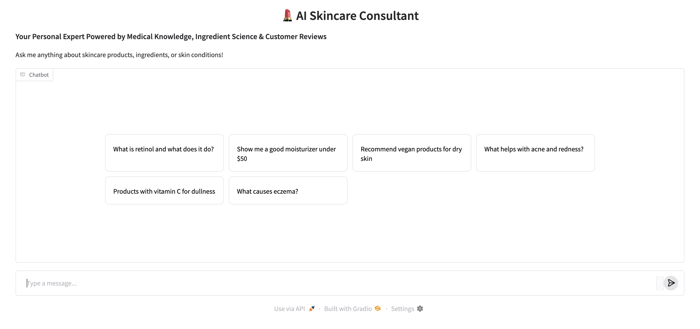

# SkinWise

## Important Links:
- *Dataset* : https://www.kaggle.com/datasets/nadyinky/sephora-products-and-skincare-reviews
- *Huggingface UI for real time execution* : https://huggingface.co/spaces/kshamaasuresh/skincare-agent
- *Google Collab code file* : https://drive.google.com/file/d/1YAom8NM-w857kqB-SeNHPIwpFlLKxxj4/view?usp=sharing
- *Google Drive Link for the video presentation, slide deck and collab code files with supporting documents* : https://drive.google.com/drive/folders/1da77WlskEXwA0Rgegt-ayM938ODsQnno?usp=sharing

## Contributors: 

SkinWise is an AI-powered skincare assistant that combines product metadata, reviews, and medical knowledge to deliver personalized recommendations to users.

*Home page for SkinWise where users can input skincare-related questions*

[Access the website here!](https://huggingface.co/spaces/kshamaasuresh/skincare-agent))

## Motivation and Goal

The global beauty market is a multi-billion dollar industry, with skincare accounting for nearly half of total sales and continuing to grow every year. However, new products and trendy ingredients are constantly entering the market, making it increasingly difficult for consumers to know which products would best suit their individual needs. Whether someone is trying to address a specific skin concern, manage a condition like acne or eczema, or stay within a budget, navigating the skincare space can be overwhelming.

To address this challenge, we developed SkinWise. ** Our goal is to bridge the gap between complex skincare information and user-friendly recommendations by allowing users to ask questions and receive custom, easy-to-understand responses.**

## Link to video

TO EDIT
## Architecture

The SkinWise workflow brings together rich skincare product and medical data and a powerful AI agent to meet users' individual needs:

1. **Data Input:** 
2. **Data Analysis:** 
3. **Model Training:** 
4. **Model Evaluation:**
5. **UI Interface:**
6. **Deployment:**

### File Structure

| Item                                | Schedule                         |
|-------------------------------------|----------------------------------|
| [Instructor Notes](completed_module/logistics/032020_EARS6_InstructorNotes.docx)| Read in preparation |
| Construct calibration stations      | Before term                      |
| [Pre-project questionairre and instructions](completed_module/components/032020_EARS6_StudentInstructions.docx)| Beginning of the term            |
| [Create google sheets for each group](completed_module/components/032020_EARS6_ExampleDataStructure.xlsx) | Before data collection           |
| Measure shoe at calibration station | As needed throughout the term    |
| Measure and record incidence angle  | Daily                            |
| Preliminary data and hypothesis ([Example results](completed_module/components/032020_EARS6_ExampleDataStructure.xlsx))     | Due determined by feedback cycle |
| Final project report                | End of term                      |
| Video Abstract                      | End of term                      |
| Reflections                         | End of term                      |

## Dependencies

A2UI is designed to be a lightweight format, but it fits into a larger ecosystem:

* **Transports:** Compatible with **A2A Protocol** and **AG UI**.
* **LLMs:** Can be generated by any model capable of generating JSON output.
* **Host Frameworks:** Requires a host application built in a supported framework
(currently: Web or Flutter).

## Getting Started

[Ask SkinWise your skincare-related questions!](https://huggingface.co/spaces/kshamaasuresh/skincare-agent))

## Limitations and Future Directions

## Team

